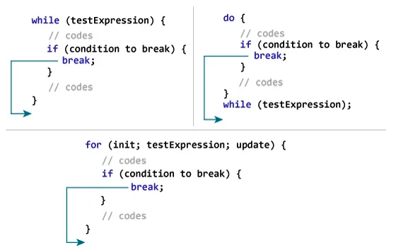

# C break statement
***
The break statement ends the loop immediately when it is encountered. Its syntax is:
```c
break;
```

## How break statement works?
***


### Example : break statement
***
```c
// Program to calculate the sum of numbers (10 numbers max)
// If the user enters a negative number, the loop terminates

#include <stdio.h>

int main() {
   int i;
   double number, sum = 0.0;

   for (i = 1; i <= 10; ++i) {
      printf("Enter n%d: ", i);
      scanf("%lf", &number);

      // if the user enters a negative number, break the loop
      if (number < 0.0) {
         break;
      }

      sum += number; // sum = sum + number;
   }

   printf("Sum = %.2lf", sum);

   return 0;
}
```

This program calculates the sum of a maximum of 10 numbers. Why a maximum of 10 numbers? It's because if the user enters a negative number, the break statement is executed. This will end the for loop, and the sum is displayed.