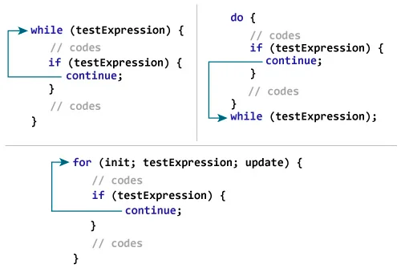

# C continue statement
***
The continue statement skips the current iteration of the loop and continues with the next iteration. 
Its syntax is:

```c
continue;
```

The `continue` statement is almost always used with the `if...else` statement.

## How continue statement works?
***


### Example : continue statement
***
```c
// Program to calculate the sum of numbers (10 numbers max)
// If the user enters a negative number, it's not added to the result

#include <stdio.h>
int main() {
   int i;
   double number, sum = 0.0;

   for (i = 1; i <= 10; ++i) {
      printf("Enter a n%d: ", i);
      scanf("%lf", &number);

      if (number < 0.0) {
         continue;
      }

      sum += number; // sum = sum + number;
   }

   printf("Sum = %.2lf", sum);

   return 0;
}
```

In this program, when the user enters a positive number, the sum is calculated using sum += number; statement.

When the user enters a negative number, the continue statement is executed and it skips the negative number from the calculation.